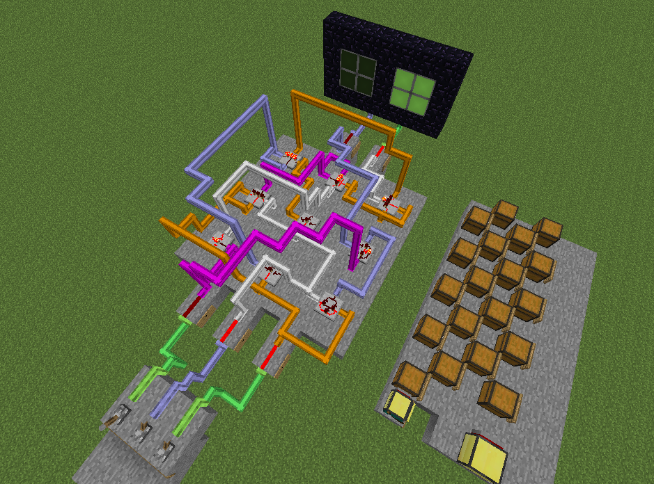

VLSI Craft
=========

### Description
VLSI Craft is a hardware generation toolchain for Minecraft inspired by [VLSI CAD: Logic to Layout](https://www.coursera.org/course/vlsicad) course. It allows you to translate simple Verilog programs into Minecraft logic gates and wires.

### Implemented features
- Combinational logic mapping
- Simple 2D placing
- Multilevel routing with conflicts resolving
- [G-code](https://en.wikipedia.org/wiki/G-code) generation
All other things like milti-level logic optimization and technology mapping are done by yosys and abc.

### Requirements
- [yosys](http://www.clifford.at/yosys/download.html) (tested with version 0.5)
- ComputerCraft mod v1.6 or later with HTTP API enabled
- redlogic mod (tested on 57.2.1)

### Compiling and running demo
- Compile yosys and place binaries into tools directory
- Compile all other tools from this project and place them into tools directory
- Go to examples/full_adder directory
- Adjust `*_job.xml` files according to your world coordinates
- Run `make`
- You will get `result.gcode` file, transfer it to the Pastebin
- Load Minecraft, place wireless turle on the origin point
- Place PC+wireless modem somewhere
- Load chests with items
- Cleanup working area
- Load GTurtle client and server software (found in the `gturtle` directory) into the turtle and pc, respectively
- Run client software
- Connect to the turtle with server software

### Known issues
- Gates can be rotated incorrectly
- Turtle can overflow and behave wrong if the number of items in chest is not a multiple of 16 (ComputerCraft bug).

### Missing features
- Routing without "ladders".
- Sequential logic is not supported for now (but can be easily added)
- 3D gate placer
- Fast placement by turtle without useless rotations
- Support for massive fan-out networks

### More screenshots

